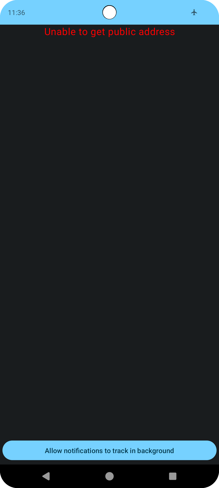
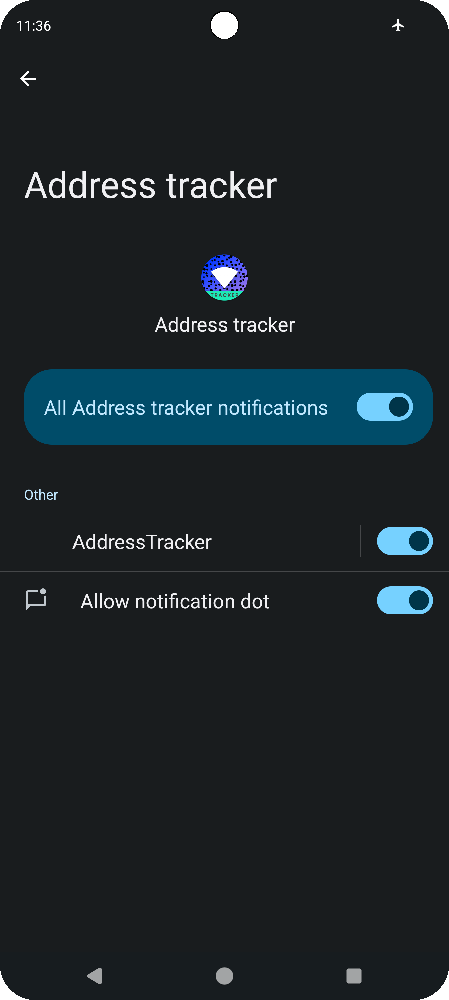
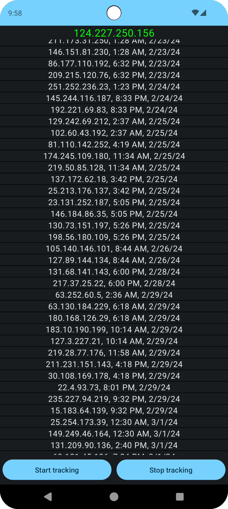
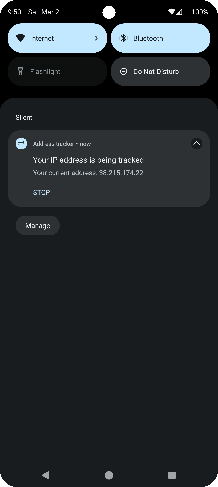

# ADDRESS TRACKER

## Description

Android application that periodically tracks devices' public IP address. Application comes with a service which is run every [3 hours](./app/src/main/java/com/example/addresstracker/feature_network_information/domain/Settings.kt) and on [network connectivity change event](./app/src/main/java/com/example/addresstracker/feature_network_information/background_service/receiver/AddressTrackerNetworkUpdateReceiver.kt). In order to run a background service users have to allow app notification ([Android requirement](https://developer.android.com/develop/background-work/services/foreground-services))

## Technical

The [ipify API](https://www.ipify.org/) is used for fetching the public address. Local data is stored with [Room](https://developer.android.com/jetpack/androidx/releases/room), and dependency injection is done with [Hilt](https://developer.android.com/training/dependency-injection/hilt-android).

Address object creation is hidden behind an [interface](./app/src/main/java/com/example/addresstracker/feature_network_information/domain/model/INetworkInformationFactory.kt). The current interface [implementation](./app/src/main/java/com/example/addresstracker/feature_network_information/persistence/room/factory/NetworkInformationOnlyWifiFactory.kt) creates objects only when device is connected to a Wi-Fi network. View models communicate with persistence layer with [use case abstraction](./app/src/main/java/com/example/addresstracker/feature_network_information/domain/use_case/NetworkInformationUseCases.kt).

## Showcase

Very "sophisticated" UI design 💀

 
 
